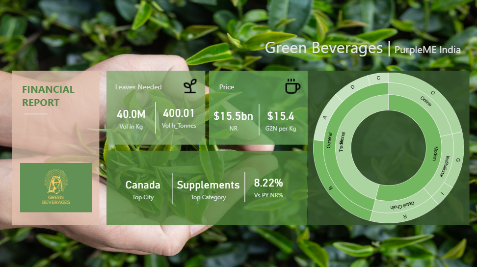
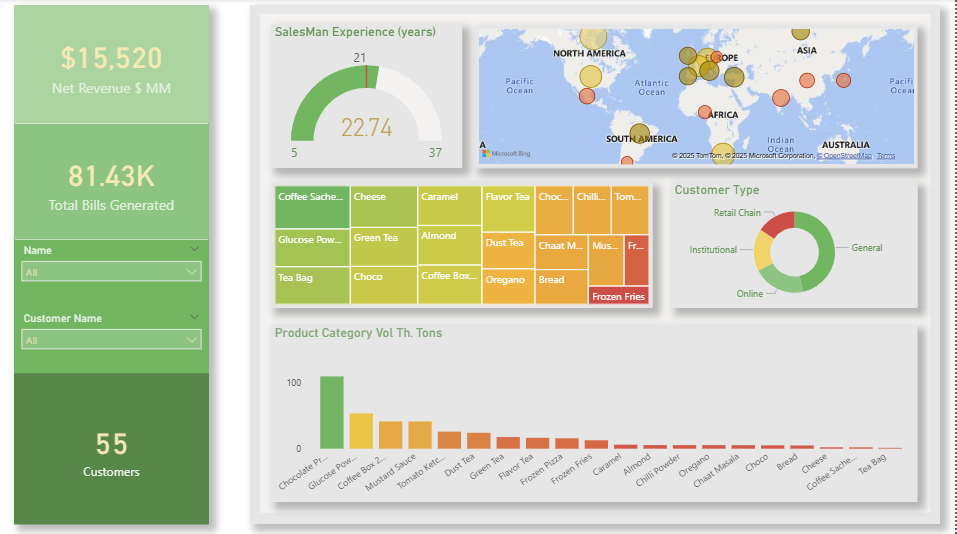
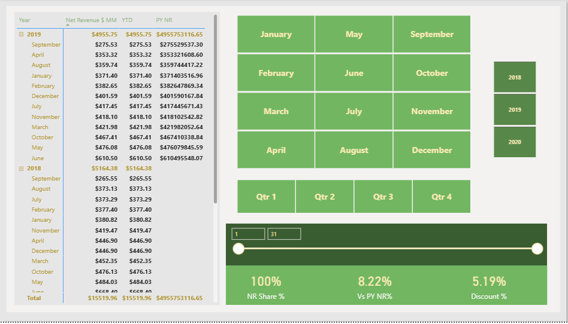

# 📊 Replica Dashboard Project

This project is a **3-page dashboard replica** built to practice and showcase my skills in **Power BI / Excel / Data Visualization**.  
The dashboard replicates a professional layout and demonstrates insights across multiple views.

---

## 🚀 Features
- **Page 1 – Overview Dashboard**  
  High-level KPIs and summary charts for quick insights.  

- **Page 2 – Detailed Analysis**  
  Drill-down views with filters and trend analysis.  

- **Page 3 – Comparative Insights**  
  Comparison charts (e.g., month vs. month, product vs. product) for deeper understanding.  

---

## 🛠️ Tools & Skills Used
- **Power BI / Excel** for dashboard creation  
- **Data Cleaning & Transformation**  
- **Visualization Best Practices**  
- **Storytelling with Data**  

---

## 📷 Screenshots
Add screenshots of each page here. Example:  

  
  
  
